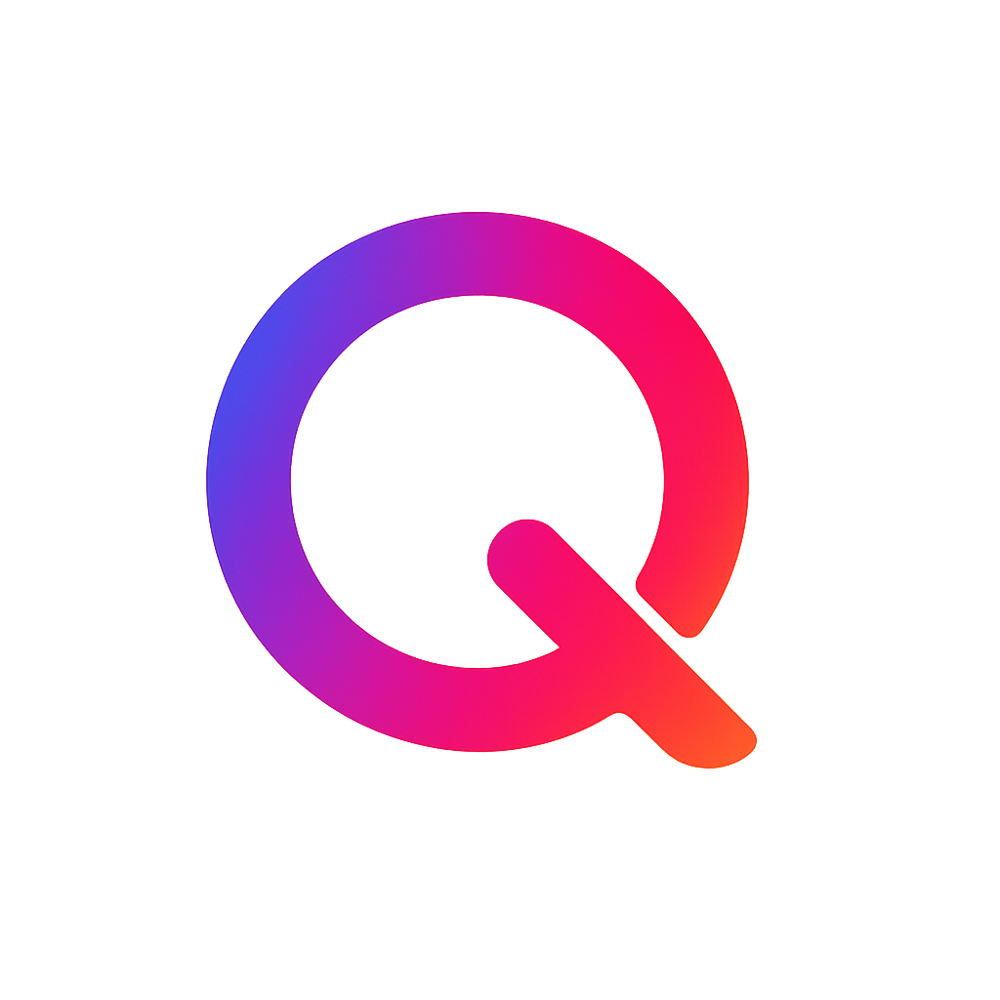

# Press Kit

Welcome to the **ng-query** press kit. Here you'll find visual resources and official information to present our project.

## Logos

### Official ng-query Logo

**Download:**
<a href="./public/assets/ng-query-logo.png" download="ng-query-logo.png">
<button style="background-color: #007ACC; color: white; padding: 10px 20px; border: none; border-radius: 5px; cursor: pointer; font-size: 14px; text-decoration: none; display: inline-block; margin-right: 10px;">
📥 Download Logo
</button>
</a>

### ng-query White Logo

  

**Download:**
<a href="./public/assets/ng-query-white.png" download="ng-query-white.png">
<button style="background-color: #333; color: white; padding: 10px 20px; border: none; border-radius: 5px; cursor: pointer; font-size: 14px; text-decoration: none; display: inline-block;">
📥 Download White Logo
</button>
</a>

## Contact

For any questions about ng-query or to get additional resources, feel free to contact us via our [GitHub repository](https://github.com/ng-angular-stack/ng-query).

---

_ng-query - Simplifying server state management in Angular applications_
